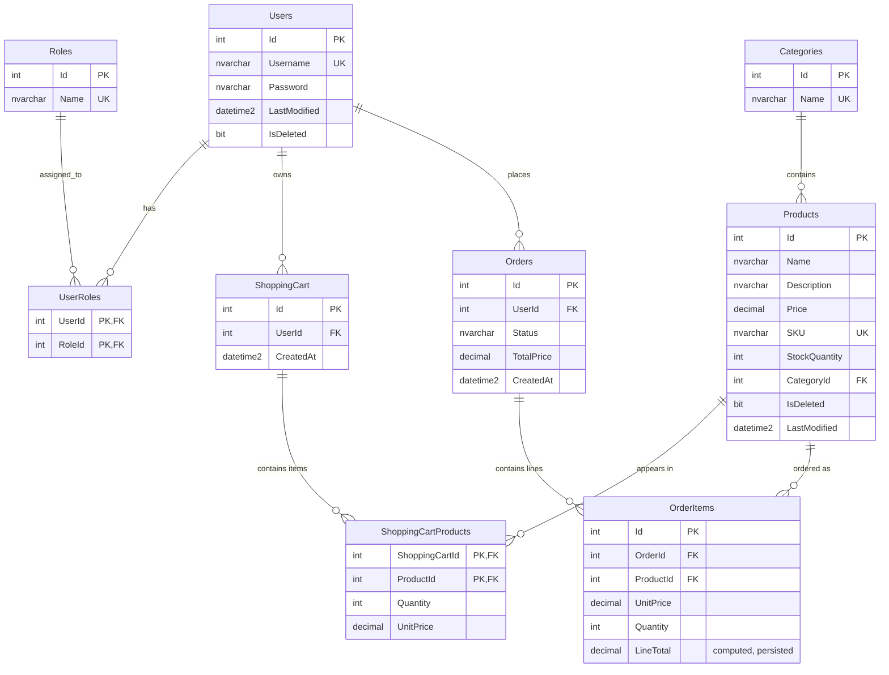

# DevAcademy — Azure Infrastructure

Terraform project that deploys an Azure environment with:

- **Resource Group**
- **Log Analytics Workspace**
- **Application Insights**
- **Windows App Service** (with System Managed Identity)
- **Azure SQL Database** (AAD-only authentication)

The App Service connects to SQL using its managed identity — no passwords stored in app config.

## Project Structure

```
infra/terraform/
 ├── main.tf            # Module composition
 ├── variables.tf       # Root variables
 ├── outputs.tf         # Root outputs
 ├── providers.tf       # Provider config (azurerm ~> 3.100)
 ├── dev.tfvars         # Dev environment values
 └── modules/
      ├── resource_group/
      ├── log_analytics/
      ├── app_insights/
      ├── app_service/
      └── sql_database/
```

## Deploy

From Azure Cloud Shell

```bash
bash <(curl -s https://raw.githubusercontent.com/tiagojfernandes/DevAcademy/refs/heads/main/deploy.sh)
```

## Database Schema
